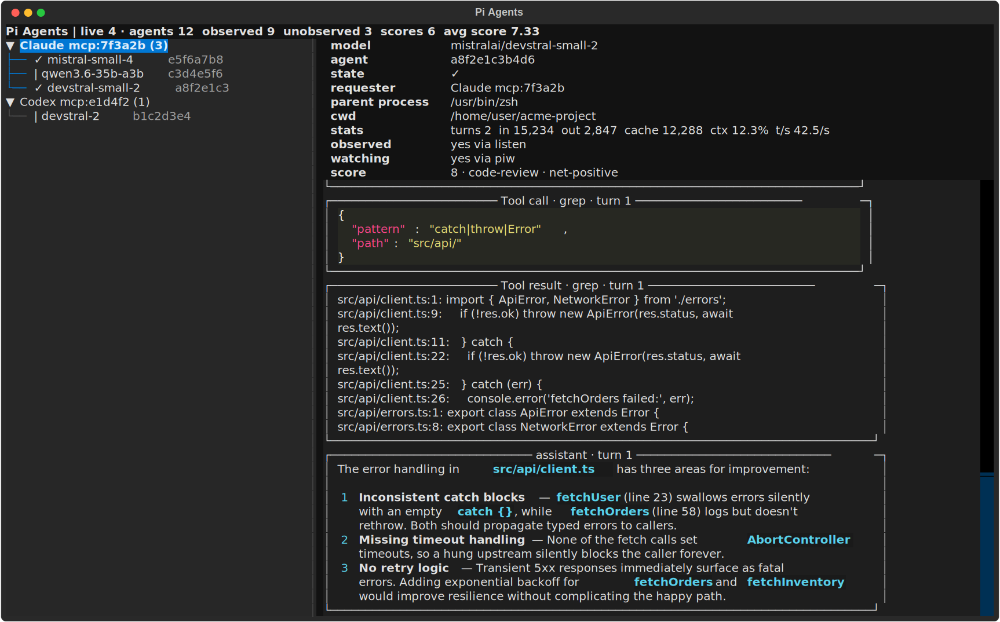

# pi-as-mcp

Tiny MCP + CLI bridge that lets frontier coding agents delegate bounded tasks
to cheaper open-source models running through [Pi](https://pi.dev/) RPC mode.



## What It Does

A parent agent (Claude, Codex, etc.) asks a sub-agent to do one small job —
read some files, grep for a pattern, fix a bug — and keeps working while the
sub-agent runs. The sub-agent is a Pi RPC worker backed by any model Pi
supports: Devstral, Qwen, Mistral, or anything else you configure.

The bridge exposes Pi as a small MCP server (`pi-as-mcp`) and as a companion
CLI (`pi-agent`) without exposing Pi's entire raw RPC protocol.

## Requirements

- Python 3.11+
- [uv](https://docs.astral.sh/uv/)
- A `pi` executable with RPC mode and model settings configured

Model selection is intentionally not hardcoded. Configure Pi itself, pass an
explicit model, or use the environment overrides documented below.

## Quick Start

```bash
uv --native-tls sync
uv --native-tls run pi-as-mcp          # start the MCP server
uv --native-tls run pi-agent-tui       # open the dashboard
```

The MCP server and CLI start `pi-agent-daemon` automatically when needed.

## MCP Config

### Claude Code

Add to `~/.claude/settings.json` (or project-level `.claude/settings.json`):

```json
{
  "mcpServers": {
    "pi-as-mcp": {
      "command": "uv",
      "args": ["--native-tls", "--directory", "/path/to/pi-as-mcp", "run", "pi-as-mcp"]
    }
  }
}
```

### Codex

Add to the relevant Codex config:

```toml
[mcp_servers.pi-as-mcp]
command = "uv"
args = ["--native-tls", "--directory", "/path/to/pi-as-mcp", "run", "pi-as-mcp"]
```

Optional environment overrides:

```toml
[mcp_servers.pi-as-mcp.env]
PI_AS_MCP_PI_BIN = "pi"
PI_AS_MCP_PROVIDER = "provider"
PI_AS_MCP_MODEL = "model-name"
```

Prefer Pi settings for normal model selection. Use the environment overrides
when you need a process-local default.

## MCP Tools

The MCP surface is intentionally small:

| Tool | Description |
|------|-------------|
| `delegate` | Start a Pi sub-agent and return a monitor command |
| `agent_reply` | Send another prompt to an existing session |
| `agent_peek` | Return the latest state without waiting |
| `agent_stop` | Abort and remove a session |
| `models` | List configured models |
| `score` | Rate a completed sub-agent (when enabled) |

There are no MCP resources, resource templates, or prompts.

### `delegate`

Start a background Pi RPC session and return immediately with `agent_id`,
`status`, `monitor_command`, and related fields. The monitor command is short:

```bash
piw <agent_id>
```

Run it in a background shell. It stays quiet while the worker runs and prints
one compact JSON object when the turn finishes.

Defaults are deliberately conservative: read-only tools only
(`read,grep,find,ls`), no context-file loading, no extensions, offline startup,
model validation before launch.

Tool modes:

| Mode | Tools |
|------|-------|
| `none` | — |
| `read-only` | `read,grep,find,ls` |
| `write` | `read,grep,find,ls,edit,write` |
| `full` | `read,grep,find,ls,edit,write,bash` |

A running turn is bounded by inactivity, not wall-clock. A turn that produces
no activity for 600 seconds is aborted as stalled (`status: timeout`).

### `agent_reply`

Send another prompt to an existing session and return another `monitor_command`.
If the agent is already running, the default behavior sends the message with
Pi's follow-up streaming. `behavior="steer"` sends it as steering instead.

### `agent_peek`

Return the latest state for an async Pi session: `status`, `final_text`,
`turn_count`, `tool_call_count`, `event_counts`. Use for manual checks or
recovery, not as the normal wait loop.

### `agent_stop`

Abort and remove a persistent Pi session.

## CLI

Use the same backend from shell commands:

```bash
pi-agent start "summarize README.md" --cwd . --tool-mode read-only
pi-agent delegate "summarize README.md" --cwd .
pi-agent summary
pi-agent summary --scoped
pi-agent models
pi-agent health --model provider/model-name
pi-agent peek <agent_id>
pi-agent wait <agent_id>
piw <agent_id>
pi-agent reply <agent_id> "now check pyproject.toml"
pi-agent stop <agent_id>
pi-agent tui
```

`pi-agent list` is an alias for `pi-agent summary`. By default it shows all
live agents across parent scopes. Pass `--scoped` to show only agents in the
current CLI parent scope.

`pi-agent tui` / `pi-agent-tui` opens the interactive dashboard shown above.

## Architecture

`pi-agent-daemon` owns the live Pi RPC workers. MCP and CLI commands are thin
clients against that daemon.

The daemon scopes summaries to an explicit client identity. Agent-specific
commands can also resolve by `agent_id` across scopes, so a background shell
monitor can wait for an MCP-created agent without needing a
`PI_AGENT_PARENT_ID=...` prefix. The MCP server sends its PID as the owner so
the daemon can reap workers when the MCP server exits.

By default, every local client for the same Unix user uses the same daemon
socket under `/tmp/pi-as-mcp-$UID`. Set `PI_AS_MCP_RUNTIME_DIR` only if you
deliberately want a separate daemon namespace.

### Async Semantics

MCP clients such as Codex and Claude Code generally do not resume the parent
agent from arbitrary server notifications after a tool call has returned. This
server therefore uses the reliable MCP shape:

1. `delegate` returns an `agent_id` and `monitor_command` quickly.
2. The parent starts `monitor_command` in a background shell.
3. The parent keeps working.
4. The background shell prints one JSON object when the turn finishes.

### Cleanup

- Workers run in their own process group.
- `agent_stop` / `pi-agent stop` aborts and terminates the worker group.
- If an explicit owner process exits, the daemon reaps that owner's workers.
- If the daemon exits normally, it stops all workers it owns.

### Idle Worker Eviction

Each agent persists its conversation to disk. When a worker finishes a turn and
sits idle past `agents.idle_eviction_seconds` (default 120s), its Pi subprocess
is killed to reclaim memory while the session stays on disk. The agent is still
reported as `idle` and remains fully resumable: the next `agent_reply`
transparently respawns a worker that resumes the exact session by id.

This bounds resident memory by the number of *concurrently active* turns rather
than by the total number of delegations. Set `idle_eviction_seconds` to `0` to
keep idle workers resident, or `persist_sessions: false` to disable persistence
entirely.

## Model Configuration

The primary source of truth is Pi's settings file:

```text
${PI_CODING_AGENT_DIR:-~/.pi/agent}/settings.json
```

The bridge resolves models in this order:

1. `enabledModels` from Pi settings for the `models` tool and CLI command.
2. `defaultModel` + `defaultProvider` from Pi settings for default delegation.
3. `PI_AS_MCP_MODEL` + `PI_AS_MCP_PROVIDER` environment fallback.
4. An explicit `provider/model` passed with `--model` or the MCP `model` arg.

There is no built-in fallback. A delegation without Pi settings or environment
overrides fails with a configuration error.

Model references may be fully qualified (`provider/model-name`) or may use a
configured alias from Pi settings.

## Local Config

The daemon reads optional settings from a single user-global file:

```text
~/.pi-as-mcp/config.json
```

There is no per-project config. Set `PI_AS_MCP_CONFIG=/path/to/config.json` to
use an explicit path.

### Concurrency Limits

```json
{
  "agents": {
    "concurrency_limits": {
      "models": {
        "provider/model-name": 2,
        "model-name": 4
      }
    }
  }
}
```

Fully qualified keys limit that provider/model pair. Bare keys limit across
providers. Only `starting` and `running` agents count — idle agents do not
block new delegations.

### Session Persistence

```json
{
  "agents": {
    "persist_sessions": true,
    "idle_eviction_seconds": 120
  }
}
```

### Unsafe Read-Only

`read-only` agents have no shell, so they cannot run `git`, build, or test
commands. Set `agents.unsafe_read_only` to `true` to launch them with the
**full** tool set, guarded by a hard "do not modify anything" instruction.

This is a soft, trust-based boundary, not a sandbox. Enable it only with
trusted models. For tasks that need shell access, use `tool_mode="full"`.

### Scoring

Set `agents.enable_score` to `true` to expose the optional `score` MCP tool.
Scores are 1–10 (>5 net-positive, <5 net-negative). When enabled, completed
wait/listen responses include a nudge asking the parent to rate the sub-agent.

### Stats and Transcripts

The daemon records append-only stats under
`${PI_AS_MCP_STATS_DIR:-~/.pi-as-mcp}`, including agent ids, models, callers,
prompts, usage, tool counts, scores, and observation status. Each agent also
gets a full transcript at `transcripts/<agent_id>.jsonl`, written live as the
worker runs.

## Development

```bash
uv --native-tls run pytest
```

Smoke test without an MCP client:

```bash
uv --native-tls run python -m pi_as_mcp.smoke \
  --cwd . \
  --model provider/model-name \
  --verbosity normal \
  "Reply with exactly: OK_PI_AS_MCP"
```
